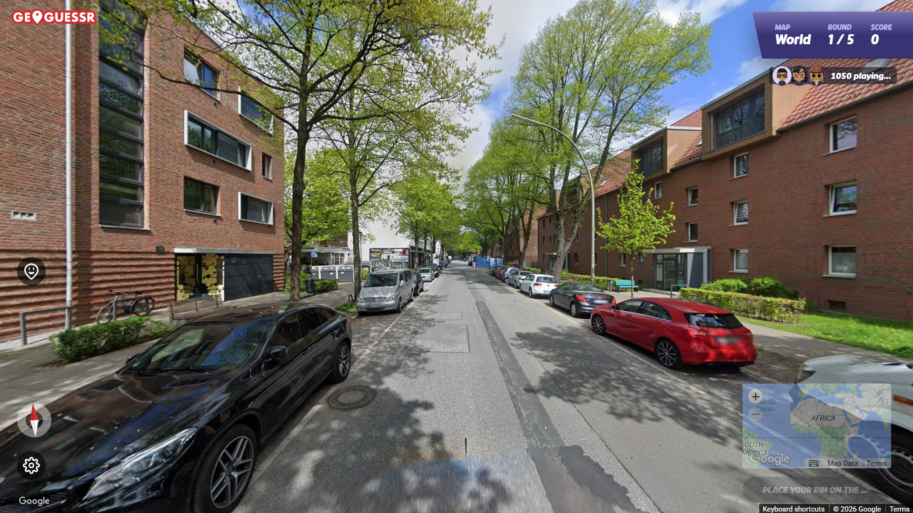

# GeoAI — Street View Location Analyzer

An AI-powered GeoGuessr assistant that analyzes street view screenshots and predicts the location on a map. Drop, paste, or try a sample image — watch the AI reason through visual clues in real time and get a pinned latitude/longitude result.



---

## Features

- **Three input methods** — drag and drop, click to browse, or paste directly with `Ctrl+V`
- **Sample image demos** — 5 pre-loaded street view images with pre-computed Claude Vision results; click any to watch a simulated analysis without needing an API key
- **Live AI thinking stream** — watch the model reason through clues in real time (script/language, driving side, road markings, bollards, vegetation, terrain, architecture, and more)
- **Interactive map** — prediction pinned on a dark Leaflet map with alternatives shown as secondary markers
- **Dual AI backend** — run locally for free with Ollama, or switch to Anthropic Claude API for results in ~8 seconds
- **Model selector** — dropdown populated live from Ollama + Claude models; switch without restarting
- **Prompt toggle** — Short mode (~400 tokens, faster) or Long mode (full GeoGuessr meta knowledge base, more accurate)
- **Expected time estimate** — predicted analysis time updates dynamically based on selected model and prompt
- **Live elapsed timer** — see exactly how long the current analysis has been running
- **Completion notifications** — in-app toast + browser notification when a result is ready
- **Two-pass JSON extraction** — if the model skips the structured format, a second lightweight pass extracts the result automatically
- **Always returns a result** — even at low confidence, coordinates are pinned on land (never in the ocean)

---

## How It Works

1. Upload a street view screenshot (or pick a sample)
2. The image is sent to your chosen vision model — either locally via Ollama or via the Anthropic Claude API
3. The model analyzes visual clues systematically:
   - Script and language on signs
   - Driving side
   - Road line colors (yellow = Americas/Japan/Korea/Australia, white = Europe/Africa)
   - Bollard styles (highly country-specific)
   - Vegetation and terrain type
   - Architecture style and building materials
   - Infrastructure (utility poles, road quality, guardrails)
4. The reasoning streams live to the AI Thinking panel
5. A structured result (country, region, lat/lng, confidence, alternatives) is parsed and pinned on the map

---

## Stack

| Layer | Technology |
|-------|-----------|
| Backend | Python, FastAPI, Uvicorn |
| AI (local) | Ollama — llama3.2-vision, moondream, llava |
| AI (cloud) | Anthropic Claude API — claude-sonnet-4-5 |
| Frontend | Vanilla HTML/CSS/JS |
| Map | Leaflet.js + CartoDB dark tiles |

---

## Setup

### Option A — Local (free, no API key)

**1. Install Ollama**

Download from [ollama.com](https://ollama.com) and install.

**2. Pull a vision model**

```bash
# Best accuracy (~8GB)
ollama pull llama3.2-vision

# Fastest / smallest (~1.7GB)
ollama pull moondream
```

**3. Clone and install dependencies**

```bash
git clone https://github.com/bharathprakashusc/geoguessr-ai.git
cd geoguessr-ai
pip install -r requirements.txt
```

**4. Run**

```bash
uvicorn main:app --reload --port 8000
```

Open [http://localhost:8000](http://localhost:8000)

---

### Option B — Claude API (fast, ~8 seconds per image)

```bash
pip install -r requirements.txt

# Windows
$env:ANTHROPIC_API_KEY="sk-ant-..."

# macOS/Linux
export ANTHROPIC_API_KEY="sk-ant-..."

uvicorn main:app --reload --port 8000
```

Claude models appear automatically in the model dropdown when the key is set. No Ollama required.

> **Cost:** ~$0.04 per image with `claude-sonnet-4-5`. $20 of credits ≈ 500 analyses.

---

## Model Comparison

| Model | Type | Speed | Accuracy |
|-------|------|-------|----------|
| `claude-sonnet-4-5` | Cloud | ~8 sec | Best |
| `claude-haiku-4-5` | Cloud | ~5 sec | Good |
| `llama3.2-vision` | Local | ~2–5 min (CPU) | Best local |
| `minicpm-v` | Local | ~2–4 min (CPU) | Medium–High |
| `llava:7b` | Local | ~3–6 min (CPU) | Medium |
| `moondream` | Local | ~1–2 min (CPU) | Low |

> **GPU users:** Ollama automatically uses your GPU — ~8x faster than CPU.

---

## Sample Images

The app ships with 5 pre-loaded street view screenshots analyzed by `claude-sonnet-4-5`. Clicking any sample card plays back the full AI reasoning with a typewriter effect and pins the result on the map — no API key or model required.

To add your own samples, drop images into `static/samples/` and run:

```bash
python scripts/analyze_samples.py          # analyze all 5
python scripts/analyze_samples.py --only 2 # re-run a single image
```

Results are saved to `data/samples.json` and picked up automatically on next server start.

---

## Knowledge Base

Long prompt mode injects a structured `data/metas.json` knowledge base covering 60+ countries with:

- Road line color conventions by country
- Driving side (left vs right) by country
- Bollard and delineator styles
- Sign color systems and scripts
- Vegetation zones (tropical, boreal, Mediterranean, savanna, desert)
- Architecture styles
- License plate color conventions
- Terrain types
- Country-specific clues (PARE vs STOP vs ALTO, soil colors, unique infrastructure)

---

## Project Structure

```
geoguessr-ai/
├── main.py                    # FastAPI backend — SSE streaming, Ollama + Anthropic routing
├── requirements.txt
├── scripts/
│   └── analyze_samples.py    # One-time script to analyze sample images with Claude
├── data/
│   ├── metas.json             # GeoGuessr meta knowledge base (60+ countries)
│   └── samples.json           # Pre-computed Claude results for sample images
└── static/
    ├── index.html             # Frontend — 3-column layout, map, live thinking stream
    └── samples/               # Sample street view screenshots (1.png – 5.png)
```

---

## License

MIT
